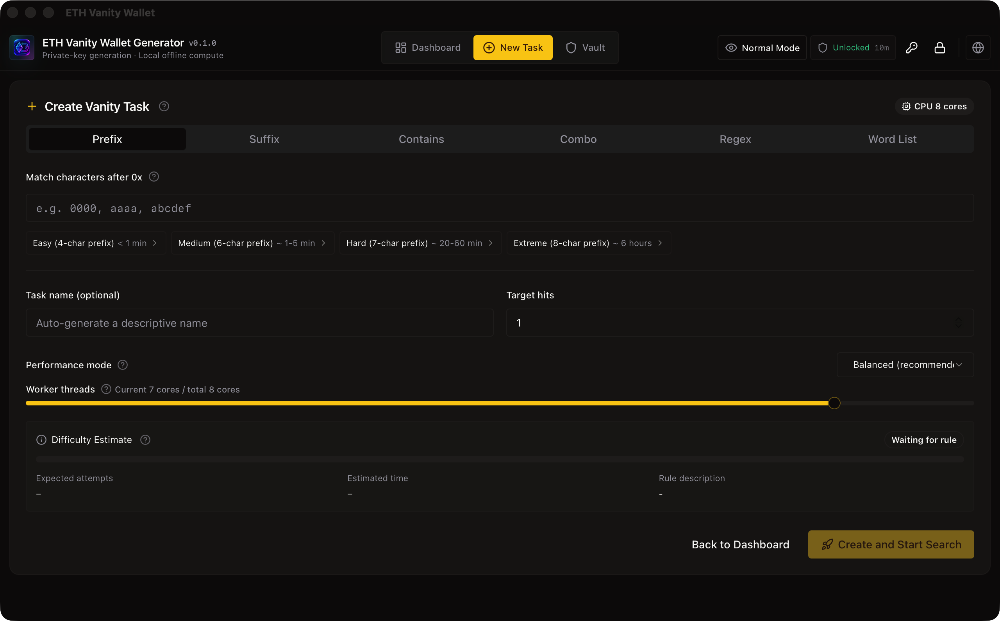
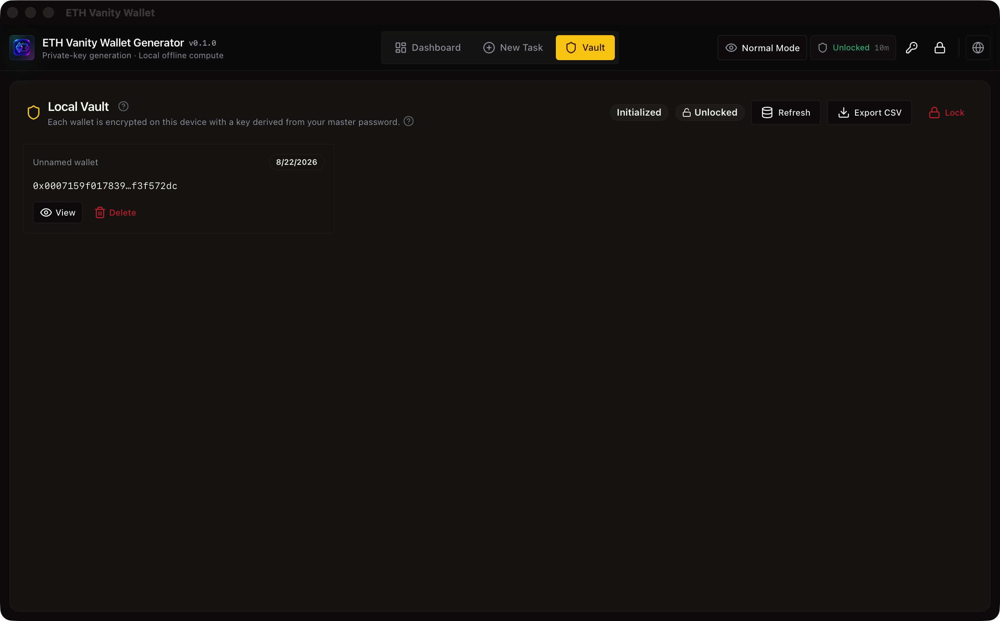

# ETH Vanity Wallet

ETH Vanity Wallet is a local-first desktop application for generating Ethereum vanity addresses. It combines multi-threaded CPU search, real-time task monitoring, and an encrypted local wallet vault in a polished Tauri desktop experience.

The product is designed for users who want custom Ethereum address patterns while keeping private keys generated, stored, and exported on their own machine.

> Security notice: vanity wallets are generated locally, but private keys still represent full control of assets. Always verify the build source, keep exports offline, and never share private keys or unencrypted CSV files.

## Product Preview

### Create Task



### Local Vault



Additional product screenshots will be added as the release package is finalized.

<!--
Additional screenshots to add later:


-->

## Highlights

- Local Ethereum vanity address generation
- Prefix, suffix, contains, combined, regex, and word-list matching rules
- Real-time task dashboard with hashrate, attempts, hits, ETA, and worker load
- CPU performance modes: power saver, balanced, and turbo
- Encrypted local wallet vault protected by a master password
- Argon2id-based key derivation and per-wallet encryption
- Privacy mode for masking addresses and preventing private key reveal/copy
- Press-and-hold private key reveal flow for safer manual inspection
- Keystore V3, private key, address, and CSV export options
- QR code generation for wallet addresses
- macOS/Windows/Linux desktop packaging through Tauri

## Product Flow

1. Set a master password on first launch.
2. Create a vanity search task by choosing a matching rule and performance mode.
3. Monitor search speed, attempts, ETA, worker load, and live hits in the dashboard.
4. Open a hit to inspect the wallet details.
5. Save selected wallets into the encrypted local vault.
6. Export keys only when needed, with explicit risk confirmation.

## Matching Rules

| Mode | Description | Example |
| --- | --- | --- |
| Prefix | Match characters immediately after `0x` | `0x0000...` |
| Suffix | Match the end of the address | `...8888` |
| Contains | Match any substring in the address | `dead` |
| Combo | Combine prefix and suffix rules | `0x0000...8888` |
| Regex | Match the full `0x`-prefixed address | `^0x0{3}.*[a-f]{4}$` |
| Word List | Match any keyword from a list | `cafe`, `dead`, `beef` |

## Security Model

ETH Vanity Wallet follows a local-first security model:

- Private keys are generated locally by the Rust backend.
- Search tasks run on the local CPU.
- Wallet vault data is stored on the local machine.
- A master password is required to unlock, save, decrypt, or export vault wallets.
- Each saved wallet is encrypted independently.
- The vault auto-locks after inactivity.
- Privacy mode prevents private key reveal/copy in shared-screen scenarios.

Important limitations:

- A vanity address does not make a wallet more secure.
- Unencrypted exports such as plain private keys or CSV files are highly sensitive.
- If the master password is lost, encrypted vault contents cannot be recovered.
- Users should verify release integrity before storing assets in generated wallets.

## Tech Stack

- Desktop runtime: Tauri 2
- Frontend: React 18, TypeScript, Vite
- Styling: Tailwind CSS, Radix UI primitives, lucide-react
- State management: Zustand
- Charts: Recharts
- Backend: Rust
- Cryptography/search: secp256k1, Keccak, Argon2id, AES-GCM, scrypt

## Development

Install dependencies:

```bash
npm install
```

Run the web frontend:

```bash
npm run dev
```

Run the Tauri desktop app in development:

```bash
npm run tauri:dev
```

Build the frontend:

```bash
npm run build
```

Build desktop release bundles:

```bash
npm run tauri:build
```

Regenerate application icons from the source logo:

```bash
npm run gen:icons
```

## Sentry Error Reporting

Frontend error reporting is integrated through Sentry and is disabled unless a DSN is configured.

Create a local `.env` from the example file:

```bash
cp .env.example .env
```

Enable Sentry for release builds:

```env
VITE_SENTRY_DSN=https://examplePublicKey@o0.ingest.sentry.io/0
VITE_SENTRY_ENABLED=true
VITE_SENTRY_ENVIRONMENT=production
VITE_SENTRY_RELEASE=eth-vanity-wallet@0.1.0
```

Privacy defaults:

- No Sentry events are sent when `VITE_SENTRY_DSN` is empty.
- `sendDefaultPii` is disabled.
- Tracing and replay sampling are disabled.
- Passwords, private keys, seed phrases, keystore data, and long hex payloads are filtered before events are sent.

## Verification

Recommended checks before release:

```bash
npm run build
cd src-tauri && cargo check
cd src-tauri && cargo test
npm run tauri:build
```

The generated macOS bundles are written to:

```text
src-tauri/target/release/bundle/macos/
src-tauri/target/release/bundle/dmg/
```

## Release Notes

Current version: `0.1.0`

This initial release focuses on the core desktop workflow:

- Vanity task creation and monitoring
- Local multi-threaded address generation
- Encrypted wallet vault
- Privacy controls
- Key export utilities
- Desktop packaging

## Disclaimer

This software is provided for educational and operational convenience. Cryptocurrency private keys control real assets. Use at your own risk, test thoroughly before storing value, and never expose private keys in screenshots, chat messages, cloud drives, email, or shared documents.
